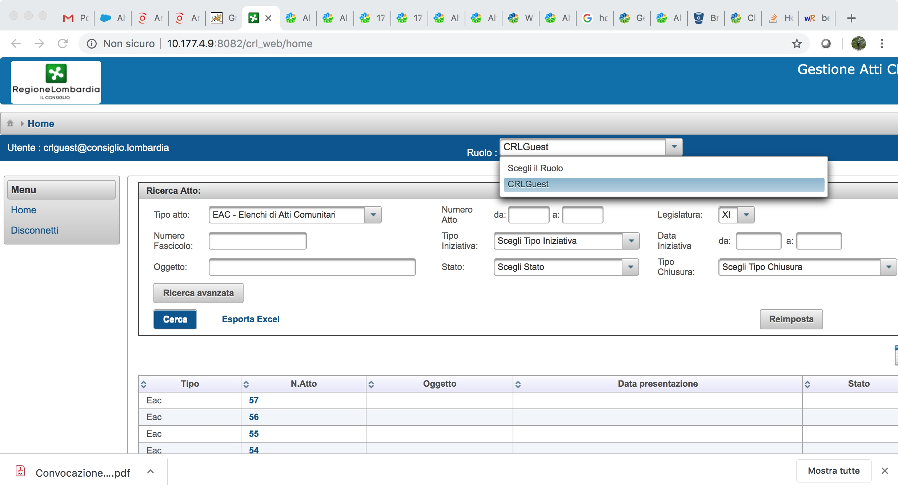
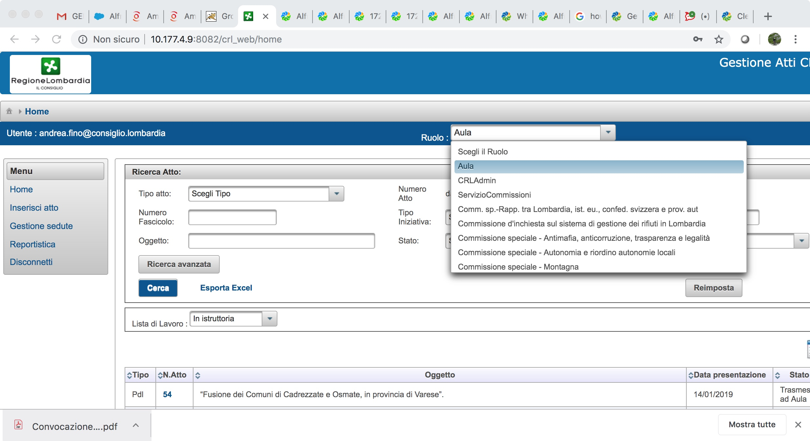
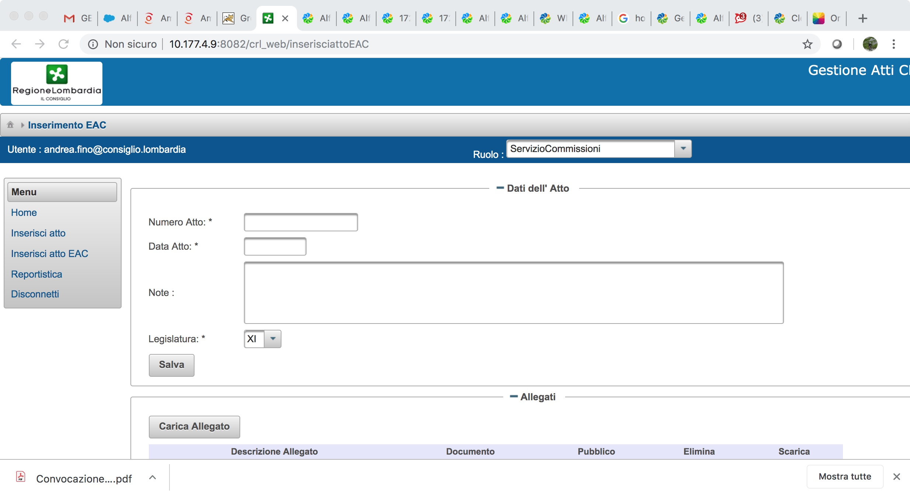
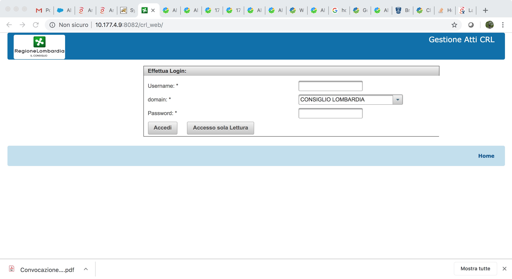
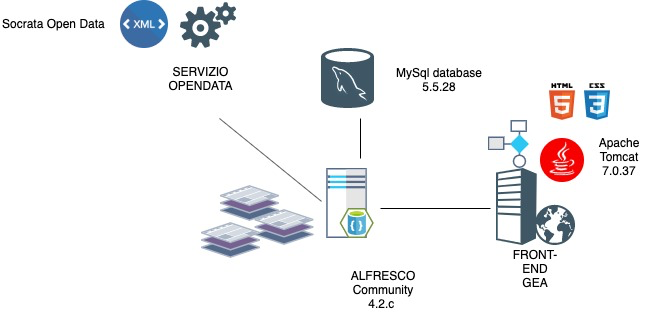

# Sistema Informativo Gestione Atti (GEA)

- Copyright Consiglio regionale della Lombardia
- Stato del progetto: stable
- Mantenimento in carico a sourcesense
- Per segnalare CVE e problemi di sicurezza scrivere a sys-admin @ sourcesense.com

### Struttiura del repositiry 

il respository consiste in un albero di direttori composto dalle seguenti cartelle:
  - doc (contiene la documentazione del progettoo in formato .html, .cocx,.pdf)
  - gestione_atti_alfresco (Modulo Amp per Alfresco)
  - gestione_atti_share (Modulo Amp per Alfresco Share)
  - web (Contiene una webapp Sprinng)
 In ognuna delle sotto cartelle potrete trovare un readme che descive il modulo e dichiara la licenza d'uso.
 Le licenze d'uso contenute in questo repository sono tre:
  - GPL 3.0
  - CC 4.0
  - Apache 2.0

### Requisiti minimi di sistema
 
 DB: MySQL 5.5 or PostgreSQL 9.0.4
 App Server: Tomcat 7.0.30 
 JDK Version: 1.7.0 u7

 Hardware: minimo:
  JVM RAM: 2 GB. La macchina deve avere al meno 6 GB di RAM.
  Disco: 5 GB
 Hardaware consigliato:
  JVM RAM: 4 GB. RAM fisica nella macchina: 12 GB
  Disco: 10GB

## contesto di utilizzo e casi d’uso (quella di domimnio)
## finalità del software (a livello di dominio)

### Screenshot

__Home__

__Home__Utente__

__Inserimento__

__Login__

Il Sistema Informativo di __Gestioni Atti del Consiglio regionale della Lombardia__ ha come architettura:

* __Front - end__: maschera che gli utenti utilizzano per entrare nel sistema.
* __Back - end__ : Alfresco Community 4.
* __Back - end__ : Sistema di pubblicazioni OPENDATA (web service).

Il __front - end__ è sviluppato utilizzando __Primefaces__ insieme a __Java JSF__. __Primefaces__ è una libreria di User Interface che è completamente integrabile con __Java JSF__. __Java Server Faces__ è una tecnologia Java che segue il pattern di Ingegneria del Software __Model-View-Controller__, il cui scopo è quello di semplificare lo sviluppo dell'interfaccia utente (UI) di una applicazione Web; può quindi essere considerata un framework per componenti lato server di interfaccia utente.

Il collegamento del __front-end__(maschera) con __Alfresco__ avviene tramite i __REST SERVICES__ di __Alfresco__ per supportare tutto il ciclo di vita di un atto. L’autenticazione si fa utilizzando un ticket di sessione con Alfresco che si fornisce ad Alfresco in ogni chiamata REST. Tutto il ciclo di vita dell’atto si trova all’interno di Alfresco mappato in una gerarchia di cartelle.

__Alfresco__ è un'applicazione Java di __Enterprise Content Management (ECM)__ basata su due differenti tipologie di storage:
* File system
* Database All'interno del file system Alfresco gestisce internamente tutti i file binari dei contenuti e tutti gli indici di ricerca.
  
__Gea__ pubblica inoltre, sul portale opendata di Regione Lombardia (www.dati.lombardia.it), le principali informazioni relative agli atti gestiti. Le pubblicazioni avvengono attraverso delle chiamate, effettuate direttamente in Alfresco utilizzando __Apache CXF__, a un webservice __SOAP__ messo a disposizione dal Consiglio regionale che si occupa di interfacciarsi con il portale opendata.

__Apache CXF__ è un framework sviluppato e mantenuto dalla fondazione Apache. Il suo nome deriva dalla fusione di due progetti (Celtix e Xfire) e l’obiettivo è quello di fornire delle astrazioni e strumenti di sviluppo per esporre varie tipologie si servizi web.

Le potenzialitá del framework si possono riassumere nelle seguenti:
* Netta separazione dall’interfaccia JAX-WS e l’implementazione
* Semplicitá di definire servizi web e client tramite annotazioni
* Alte performance
* Alta modularitá dei suoi componenti (che rende possibile esporre servizi standalone o su servlet container)

__MODULO crl_web__

Questo modulo permette all'utente di seguire il ciclo di vita del documento legale. Una volta compilato, si ottiene una webapp che si connette ad Alfresco, a seconda del profilo utente (ottenuto dal LDAP), permette all'utente di effettuare operazioni di lettura/scrittura relative ad un documento ufficiale. 
La webapp si connette ad Alfresco e mostra un'interfaccia utente personalizzata con diverse sezioni come ad esempio: 
* home
* inserimento di un nuovo documento legale, 
* gestione delle sessioni di parlament
* report

Il ciclo di vita del documento deve essere inteso come un flusso di lavoro con diversi passaggi. 
A seconda dei permessi dell'utente, un ciclo di vita completo può essere completato e pubblicato.

La webapp è sviluppata utilizzando il framework __Spring__. 
__Spnego__ viene utilizzato per lo scambio di informazioni con l'utente. Per UI, JSF. Viene implementato un modello software MVC.

__MODULO crl_business__

Questo modulo implementa tutte le logiche di business che comunicano con Alfresco e crea tutte le operazioni documentali durante il ciclo di vita di un documento..... Il jar finale costruito viene utilizzato in crl_web. 

__MODULO gestione_atti_share__

Questo modulo appartiene alla __ALFRESCO SDK__. Con questo modulo è possibile costruire un'istanza di Alfresco Share che può essere rilasciata in un server jetty (come ciclo di vita di maven). 
Questo non è un artefatto Alfresco-all-in-one, quindi non è necessario alcun modulo alfresco. 
In questo modulo è possibile vedere tutte le personalizzazioni di alfresco share per il ciclo di vita dei documenti della Regione Lombardia. 
La maggior parte delle personalizzazioni si trovano su share-config-custom.xml. 
Diverse tipologie sono dichiarate per creare questo tipo di documenti direttamente da Share alfresco. 
Anche gli aspetti personalizzati del modello di contenuto CRL sono mostrati agli utenti finali.
Anche i metadati per i documenti CRL-documenti su moduli Share sono personalizzati. La ricerca avanzata è personalizzata anche per la Regione Lombardia. 

## Licenza

Concesso in licenza a norma GPL 3.0 cosi come descritta nel file LICENSE

Non è possibile utilizzare l'opera salvo nel rispetto della Licenza.

È possibile ottenere una copia della Licenza al seguente indirizzo: https://www.gnu.org/licenses/gpl-3.0.txt

Salvo diversamente indicato dalla legge applicabile o concordato per iscritto, il software distribuito secondo i termini della Licenza è distribuito "TAL QUALE", SENZA GARANZIE O CONDIZIONI DI ALCUN TIPO, esplicite o implicite.

Si veda la Licenza per la lingua specifica che disciplina le autorizzazioni e le limitazioni secondo i termini della Licenza.
